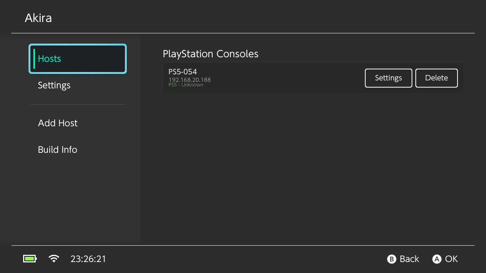
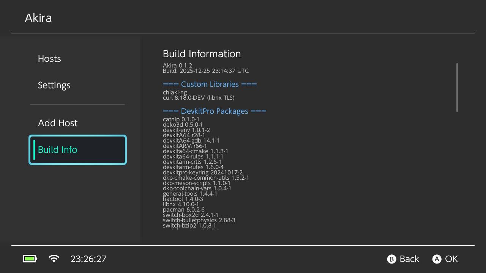

# Akira
Akira is a hombrew application built with xfangfang's fork of [borealis](https://github.com/xfangfang/borealis) that utilises a forked variant of [chiaki-ng](https://github.com/streetpea/chiaki-ng) on the Nintendo Switch.

  
  
  

<video src="https://github.com/user-attachments/assets/faf40b34-0fe1-43f0-ab9b-6896671971e5" width="80%" controls></video>

## Blurb
I initially started working on this when FW 21 broke chiaki-ng.The changes I was going to be making was very invasive, and so I took it out of tree first, switching to a homebrew nro that wraps chiaki-ng as a dependency. I may upstream this back into chiaki-ng eventually. However, the current state of this (local discovery, wake, connect, play/stream) and general performance is good enough for me.

At this point I'm a place where I can seat back and enjoy my christmas break to play Avatar while my partner watches something else on the telly.

So far I have been testing auto discovery -> Register ->  Wake -> Connect -> Play against a PS5. My pirority has been to get the streaming bit working with deko3d well.

Disconnecting etc is still problematic and crashes and will most likely require an app restart for now.

Dont ask for remote because I spent over an hour refreshing PSN's login page and I was never able to get in.

## Changes from in-tree
- No longer need to compile switch-dav1d and switch-ffmpeg with hwaccel support as these have been brought into devkitpro
- Just used the devkitpro builder docker image 
- Used [deko3d](https://github.com/devkitPro/deko3d) for rendering rather than openGL which should have better performance (due to lower overhead)
- Removed mbedTLS entirely and replace with libnx/software crypto/micro-ecc depending on what algorithm is needed. [forked chiaki-ng:](https://github.com/xlanor/chiaki-ng/blob/5907140e730ff975a01aa8a6eca51ac5c6ca9f41/lib/src/crypto/libnx/README.md). Mind you, I dont know if the in-tree crypto works for PSN handshakes because I could never login properly on the desktop after trying for ages.
- Use libNX starting from 4.1.0 and used a [custom](https://github.com/xlanor/curl) version of cURL 8.18.0 with the libNX vTLS backend. I built a secondary app to test cURL functionality and it works.
- Deprecate the original borealis version that was used and use xfangfang's fork of [borealis](https://github.com/xfangfang/borealis) with the [yoga](https://github.com/facebook/yoga) rendering engine
- Rather than going to the HID directly, use the built in rumble methods exposed in borealis. 

I really do not recomend you do 1080p/60fps even though the option is there. 720p/60fps was enough/very enjoyable for me. The switch without being overclocked is completely horrible at 1080p/60fps. use at your own risk.

This software relied extremely heavily on refrencing/taking bits from:

- [Streetpea](https://github.com/streetpea/chiaki-ng) the original chiaki-ng code
- [moonlight-switch](https://github.com/XITRIX/Moonlight-Switch) XITRIX's deko3d renderer for moonlight for the deko3d bits
- [switchfin](https://github.com/dragonflylee/switchfin/blob/bbcf9037fc3b11a78f5e0b7489d9e776fff2d99c/scripts/switch/mpv/deko3d.patch#L371) The patches used by dragonflylee in switchfin
- [wiliwili](github.com/xfangfang/wiliwili) WiliWili for how to get started with this new borealis api.

## Credits
- [Streetpea](https://github.com/streetpea/chiaki-ng) for chiaki-ng and your tireless effort in maintaining this library.
- [moonlight-switch](https://github.com/XITRIX/Moonlight-Switch) for the deko3d rendering code that I based it off with some changes 
- [thestr4ng3r](https://git.sr.ht/~thestr4ng3r/chiaki) for the original chiaki
- [devkitpro](https://github.com/devkitPro) for the associated homebrew packages
- [yellows8](https://github.com/devkitPro/curl/commits/libnx-backend/) for the work on the libnx backend which I used and updated for curl 8.18.0
- [xfangfang](https://github.com/xfangfang), [dragonflylee](https://github.com/dragonflylee), and [XITRIX](https://github.com/XITRIX) for all the work on borealis, moonlight, wiliwili, and switchfin which have made developing homebrew a much smoother experience due to all the examples avaliable.
- [kkwong](https://git.sr.ht/~kkwong/chiaki) for the initial hwacel and rumble patches
- H0neyBadger for the initial switch port
- [micro-ecc](https://github.com/kmackay/micro-ecc) for the ECDH implementation that was vendored in.
- [vecteezy](https://www.vecteezy.com/vector-art/27484683-shiba-inu-logo) for the shiba inu logo because I like shiba inus.

## Issues

If you find a bug or have a feature request, please open a PR with the fix/implemented feature. Thanks!

