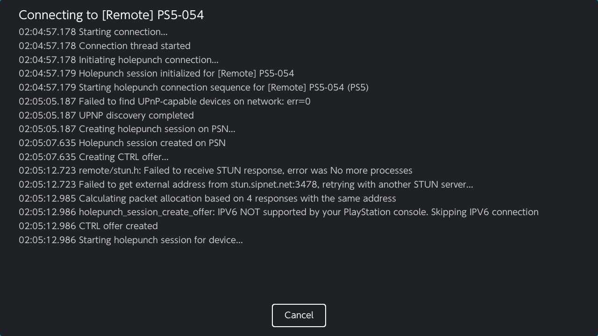

# Akira
Akira is a hombrew application built with xfangfang's fork of [borealis](https://github.com/xfangfang/borealis) that utilises a forked variant of [chiaki-ng](https://github.com/streetpea/chiaki-ng) on the Nintendo Switch.

This is still considered unstable/beta, bugs are expected.

  

  
  

  
  

And some horribly compressed encodes to fit < 10mb:

i

<video src="https://github.com/user-attachments/assets/1ae8a3e3-9123-43cf-ae2e-f038383ef87d" width="80%" controls></video>

<video src="https://github.com/user-attachments/assets/13bff761-42a8-43d6-901c-4aca7dbc26f0" width="80%" controls></video>

## Blurb
I initially started working on this when FW 21 broke chiaki-ng.The changes I was going to be making was very invasive, and so I took it out of tree first, switching to a homebrew nro that wraps chiaki-ng as a dependency. I may upstream this back into chiaki-ng eventually. 

At this point I'm a place where I can seat back and enjoy my christmas break to play Avatar while my partner watches something else on the telly.

## Changes from in-tree
[Read this](https://github.com/xlanor/akira/wiki/Additional-changes)

The biggest change is probably the removal of openGL and cutover to deko3d.

The second biggest feature change is the addition of PSN remote play. Thanks to the hard work by Streetpea on chiaki-ng, I just call whatever he has built. You should see two screens come up if this is successful.

The first screen is going to be for the CTRL holepunching, and the second screen for DATA holepunching after the session has been initalised. Rather than show an empty screen I decided to just stream the logs.

## How to get started
[Read this for local](https://github.com/xlanor/akira/wiki/Registering-and-Connecting-(Local-Network))

[Read this for remote](https://github.com/xlanor/akira/wiki/Registering-and-Connecting-(Remote-Network))

Actually, just read the whole wiki.

---

This software was built with reference/code from:

- [Streetpea](https://github.com/streetpea/chiaki-ng) the original chiaki-ng code
- [moonlight-switch](https://github.com/XITRIX/Moonlight-Switch) XITRIX's deko3d renderer for moonlight for the deko3d bits
- [switchfin](https://github.com/dragonflylee/switchfin/blob/bbcf9037fc3b11a78f5e0b7489d9e776fff2d99c/scripts/switch/mpv/deko3d.patch#L371) The patches used by dragonflylee in switchfin
- [wiliwili](github.com/xfangfang/wiliwili) WiliWili for how to get started with this new borealis api.

## Credits
- [Streetpea](https://github.com/streetpea/chiaki-ng) for chiaki-ng and your tireless effort in maintaining this library.
- [moonlight-switch](https://github.com/XITRIX/Moonlight-Switch) for the deko3d rendering code that I based it off with some changes 
- [thestr4ng3r](https://git.sr.ht/~thestr4ng3r/chiaki) for the original chiaki
- [devkitpro](https://github.com/devkitPro) for the associated homebrew packages
- [yellows8](https://github.com/devkitPro/curl/commits/libnx-backend/) for the work on the libnx backend which I used and updated for curl 8.18.0
- [xfangfang](https://github.com/xfangfang), [dragonflylee](https://github.com/dragonflylee), and [XITRIX](https://github.com/XITRIX) for all the work on borealis, moonlight, wiliwili, and switchfin which have made developing homebrew a much smoother experience due to all the examples avaliable.
- [kkwong](https://git.sr.ht/~kkwong/chiaki) for the initial hwacel and rumble patches
- H0neyBadger for the initial switch port
- [micro-ecc](https://github.com/kmackay/micro-ecc) for the ECDH implementation that was vendored in.
- [vecteezy](https://www.vecteezy.com/vector-art/67445984-adorable-capybara-illustration-enjoying-a-drink) for the capybara logo.

## Issues

If you find a bug or have a feature request, please open a PR with the fix/implemented feature. Thanks!

