# Akira

  

Akira is a hombrew application built with xfangfang's fork of [borealis](https://github.com/xfangfang/borealis) that utilises a forked variant of [chiaki-ng](https://github.com/streetpea/chiaki-ng) on the Nintendo Switch.

## Maintainers
xlanor, kkwong

## Disclaimer
This project is not endorsed or certified by Sony Interactive Entertainment LLC. This project is free and open-source, and licensed under the same license as the core library it uses, chiaki-ng.

## Read the documentation

Please read the docs at [xlanor.github.io/akira](https://xlanor.github.io/akira)

## Issues

Akira is a personal project developed for myself primarily as the main user. Please don't come in and treat me like your personal slave, because I'm getting very tired of debugging people's networks with almost no information at all other than "this doesnt work". If I had a crystal ball, I would use it to win the Euromillions.

I am present on chiaki-ng discord's switch-support channel, where StreetPea has graciously allowed me to seed akira amongst existing chiaki-ng users. 

I will not respond to direct pings, please try to use the search button and/or [read the docs](https://xlanor.github.io/akira) first and then post a message with details of what you've tried. 

I'd also love to hear if you're using this application and it works well for you.

If you find a bug or have a feature request, please help out and open a PR with the fix/implemented feature. 

## Features

- **Basic remote play over an external network.** Same caveats as chiaki-ng, PSPlay, PSPortal, and the rest: you have to punch through to PSN for initiation. 
- **Cloud Streaming**
- **Multiple PSN profiles**
- **Select bitrate.**
- **Hidden menu** (think unlocking developer settings on Android) to raise the bitrate cap to 30k. You *request* a bitrate. The PS5 may or may not give it to you. It's not constant-bitrate encoding.
- Gyro support and reset including the ability to pick which controller drives gyro (default left)
- After many nights debugging with kkwong, input latency is comparable with running android on your switch.
- Switch away from mbedTLS to libnx crypto
- Stream debug menu with stats
- Stream disconnection ability
- **Fully supported in-app wireguard.** (No tailscale support will be forthcoming, stop asking)
- **Fully Remappble input bindings**
- Ability to sleep the console on exit
- **FSR 1.0** with configurable filters
- Trophy page support
- Auto-registration over PSN, requires holepunching.
- Cross-subnet discovery (swept by unicast)
- AIA chain repair (when encountering a PSN node with only leaf TLS certs)

## How to get started
Please read the docs at [xlanor.github.io/akira](https://xlanor.github.io/akira)

## Screenshots

  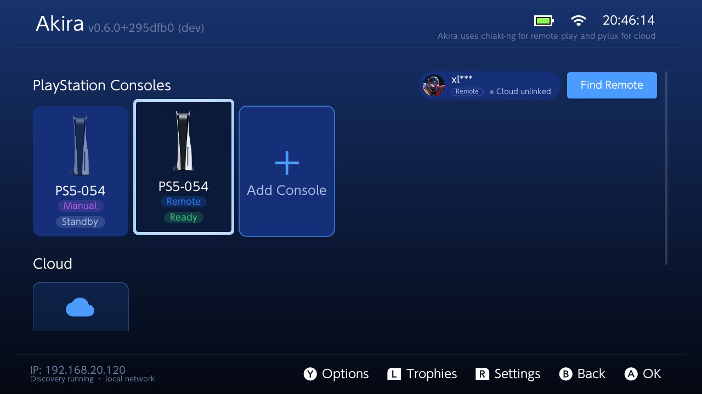
  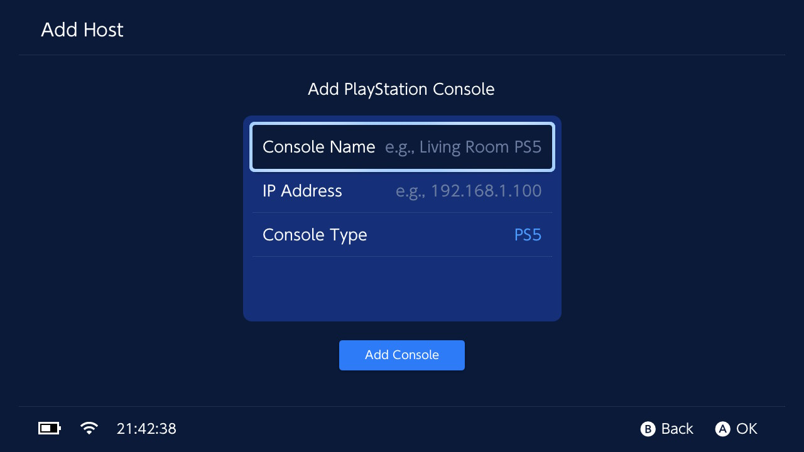

  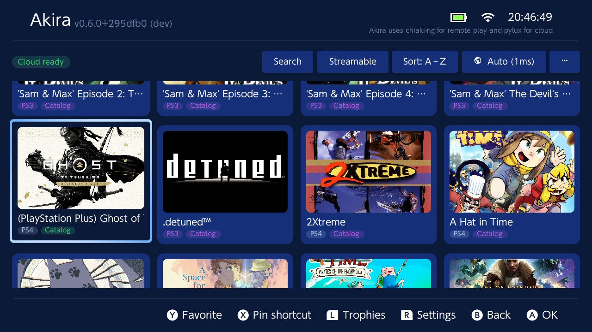
  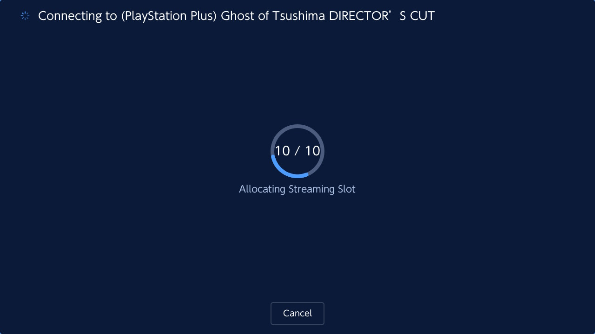

  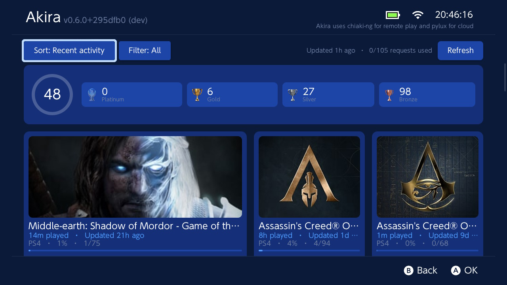
  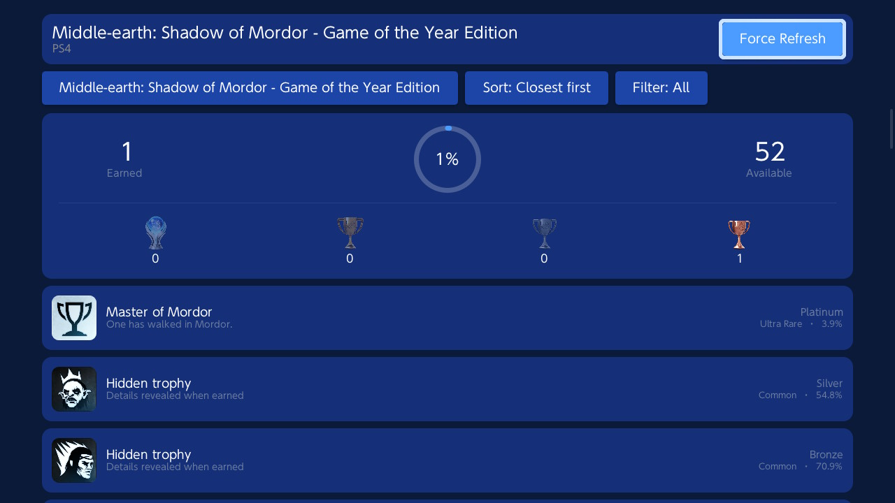

  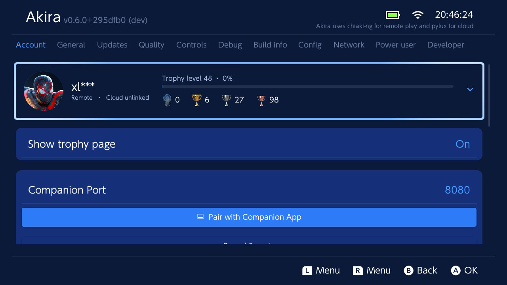
  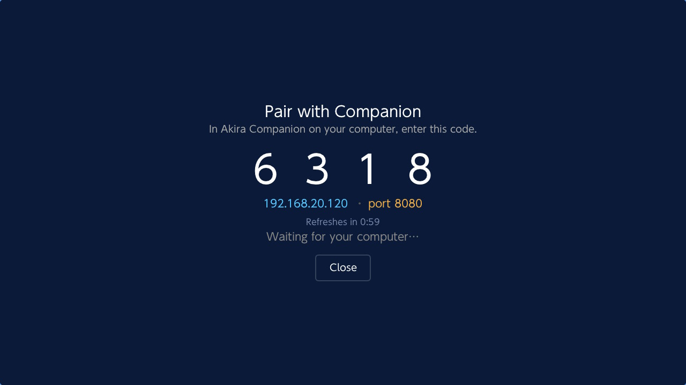

  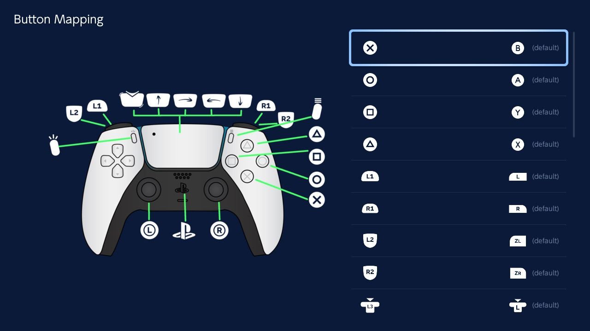

  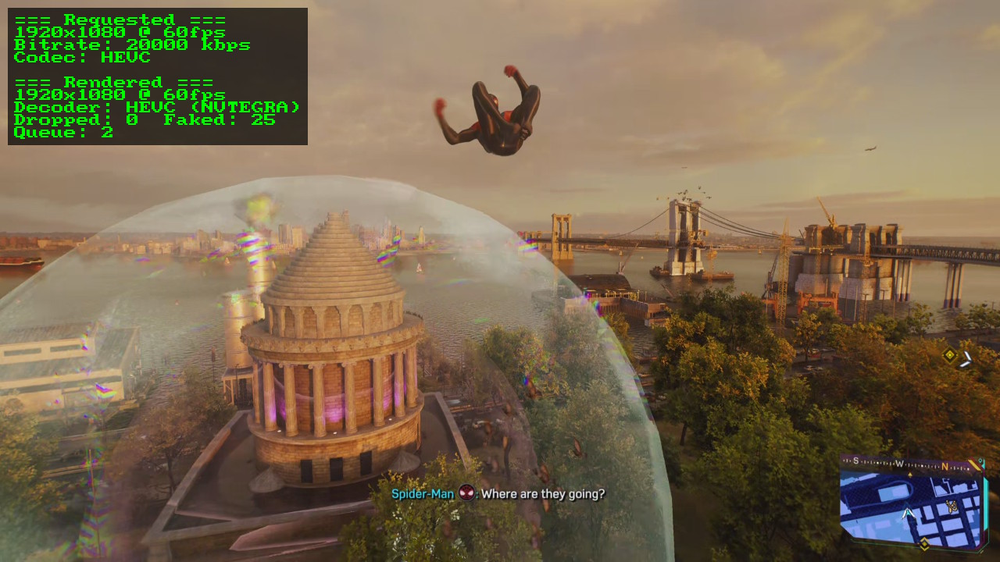
  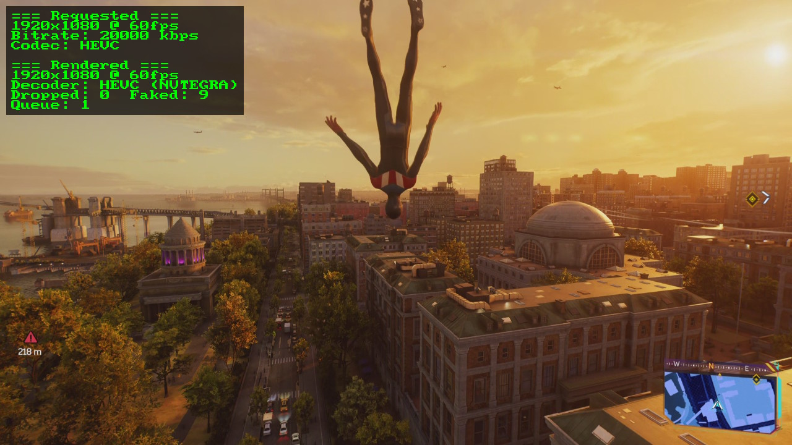

  
  
  

And some horribly compressed encodes to fit < 10mb:

<video src="https://github.com/user-attachments/assets/13bff761-42a8-43d6-901c-4aca7dbc26f0" width="80%" controls></video>

---

This software was built with reference/code from:

- [Streetpea](https://github.com/streetpea/chiaki-ng) the original chiaki-ng code
- [Pylux](https://github.com/ForWard-Technologies-LLC/Pylux) for the PS Cloud Streaming implementation
- [moonlight-switch](https://github.com/XITRIX/Moonlight-Switch) XITRIX's deko3d renderer for moonlight for the deko3d bits
- [switchfin](https://github.com/dragonflylee/switchfin/blob/bbcf9037fc3b11a78f5e0b7489d9e776fff2d99c/scripts/switch/mpv/deko3d.patch#L371) The patches used by dragonflylee in switchfin
- [wiliwili](https://github.com/xfangfang/wiliwili) WiliWili for how to get started with this new borealis api.
- [duckstation](https://github.com/RSDuck/duckstation) Duckstation's uam fork for runtime shader compilation

## Credits
- [PS5 icons by Zacksly, please support him here:](https://zacksly.itch.io/ps5-button-icons-and-controls)
- [Switch icons by zacksly, please support him here:](https://itch.io/queue/c/1334295/designs-by-zacksly?game_id=885118&password=)
- [Florian Grill (PXPlay dev](https://streamingdv.github.io/psplay/index.html) for the reverse engineering of the PS Remote Play API
- [Streetpea](https://github.com/streetpea/chiaki-ng) for chiaki-ng and your tireless effort in maintaining this library.
- [moonlight-switch](https://github.com/XITRIX/Moonlight-Switch) for the deko3d rendering code that I based it off with some changes 
- [thestr4ng3r](https://git.sr.ht/~thestr4ng3r/chiaki) for the original chiaki
- [devkitpro](https://github.com/devkitPro) for the associated homebrew packages
- [yellows8](https://github.com/devkitPro/curl/commits/libnx-backend/) for the work on the libnx backend which I used and updated for curl 8.18.0
- [xfangfang](https://github.com/xfangfang), [dragonflylee](https://github.com/dragonflylee), and [XITRIX](https://github.com/XITRIX) for all the work on borealis, moonlight, wiliwili, and switchfin which have made developing homebrew a much smoother experience due to all the examples avaliable.
- [kkwong](https://git.sr.ht/~kkwong/chiaki) for the initial hwacel and rumble patches
- H0neyBadger for the initial switch port, as well as all switch/chiaki contributors especially Egoistically and kkwong
- [micro-ecc](https://github.com/kmackay/micro-ecc) for the ECDH implementation that was vendored in.
- [vecteezy](https://www.vecteezy.com/vector-art/67445984-adorable-capybara-illustration-enjoying-a-drink) for the capybara logo.

